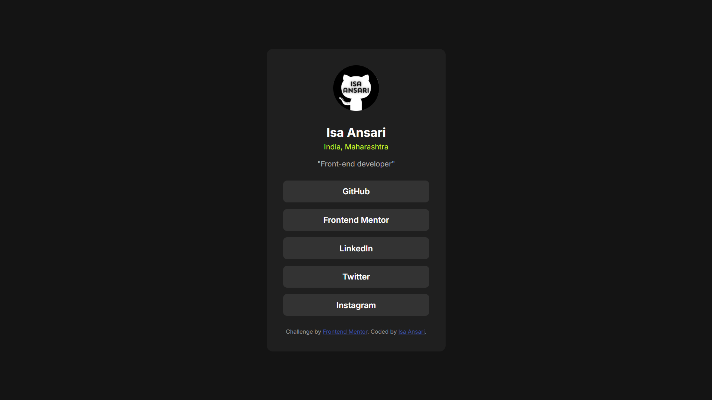
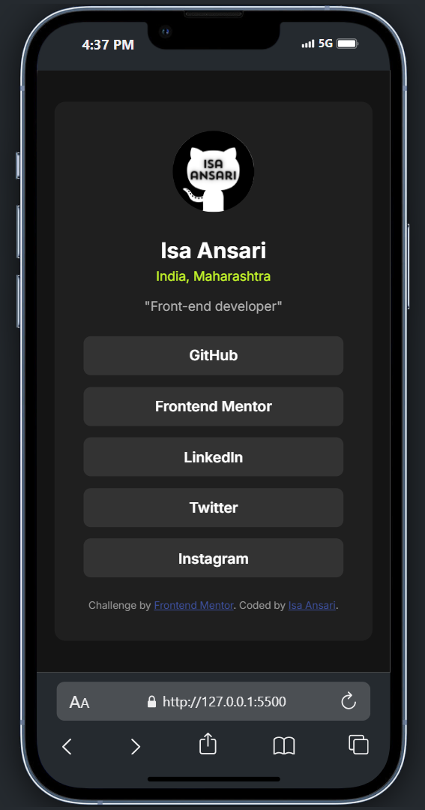

# Frontend Mentor - Social Links Profile Solution

This is my solution to the [Social Links Profile Challenge](https://www.frontendmentor.io/challenges/social-links-profile-UG32l9m6dQ) on Frontend Mentor.

## 📸 Screenshot

## 🔗 Live Site

- [Live Site URL](https://isaansari.github.io/Social-links-profile/)
- [Solution on Frontend Mentor](https://www.frontendmentor.io/solutions/social-links-profile-a2h_Rd6tEt)

## 🛠️ Built With

- Semantic HTML5
- CSS Flexbox
- Responsive Design
- Google Fonts – Inter

## 🧠 What I Learned

While building this project, I practiced:
- Creating a clean, responsive card layout using Flexbox
- Styling hover states for interactive elements
- Using a mobile-first workflow

## 🙋‍♂️ Author

- Frontend Mentor – [@IsaAnsari](https://www.frontendmentor.io/profile/IsaAnsari)
- GitHub – [@IsaAnsari](https://github.com/IsaAnsari)
